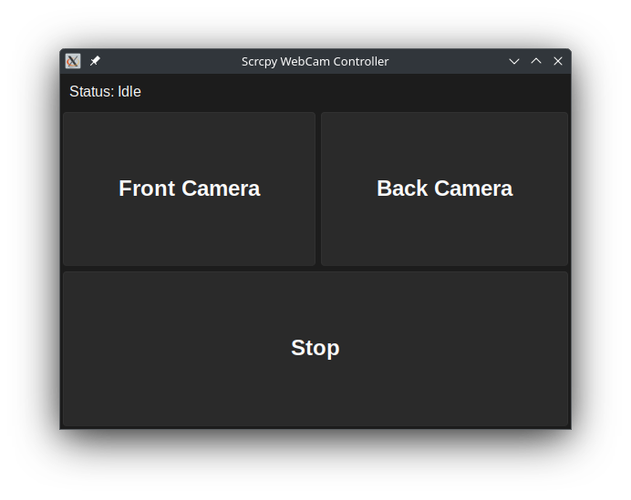

# Scrcpy WebCam Controller

## Description

Scrcpy WebCam Controller is a Python application that allows you to control your Android device's cameras as a webcam on your computer. It utilizes the Scrcpy tool to mirror your Android device's screen and camera feed to your computer. 	



## Features

- Switch between front and back cameras
- Stop camera feed
- User-friendly GUI with dark theme
- Status display
- Virtual video device creation using v4l2loopback

## Requirements

- Python 3.x
- Tkinter
- sv_ttk
- Scrcpy
- v4l2loopback (for Linux systems)

## Installation

1. Ensure you have Python 3.x installed on your system.

2. Install the required Python packages:

   ```bash
   pip install sv_ttk
3. For Arch Linux , install v4l2loopback:

    ```bash
    sudo pacman -S v4l2loopback-dkms
## Usage

1. Connect your Android device to your computer via USB.
2. Enable USB debugging on your Android device.
3. For Linux systems, load the v4l2loopback module: 

   ```
   sudo modprobe v4l2loopback video_nr=5 card_label="Virtual" exclusive_caps=1
   ```

This creates a virtual video device (/dev/video5 in this case).

#### Run the script
   ```
   python scrcpy_webcam_controller.py
   ```
## Troubleshooting

- Ensure your Android device is properly connected and USB debugging is enabled.
- If the camera feed doesn't appear, try restarting the application or reconnecting your device.
- Check if Scrcpy is properly installed and accessible from the command line.
- For Linux users, ensure the v4l2loopback module is loaded correctly. You may need to adjust the video_nr value if /dev/video5 is already in use.

## License

MIT License
